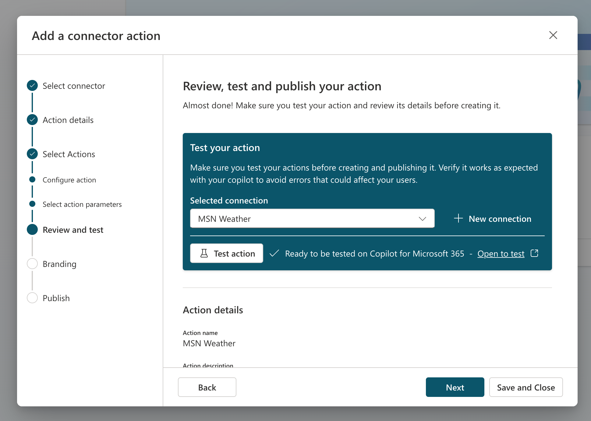

# Ejercicio: Creación de una acción de conector

En este ejercicio, aprenderás a:

- Crear una acción de conector en Copilot Studio
- Probar una acción del conector en Microsoft Teams
- Guardar y publicar la acción del conector

## Tarea 1: Creación de una acción de conector en Copilot Studio

En esta tarea, configurarás una acción de conector para el conector MSN El Tiempo.

1. Ve a [Copilot Studio](https://copilotstudio.microsoft.com) y si se te solicita inicia sesión con una cuenta profesional o educativa. Omite los mensajes de bienvenida.

    **Nota:** la primera vez que abras Copilot Studio, puede mostrar una interfaz de chat para crear el primer copiloto. Si esto sucede, selecciona el menú **...** en la parte superior derecha (junto al botón **Crear**) selecciona **Cancelar creación de copiloto** para salir de la interfaz de chat y ver la página principal de Copilot Studio.
1. Selecciona **Biblioteca** en el panel de navegación izquierdo. Aquí puedes ver una lista de las acciones y conectores existentes y crear una nueva.
1. Selecciona **Agregar un elemento** en la parte superior.  Un menú muestra 2 opciones para ampliar Copilot para Microsoft 365.
:::image type="content" source="../Media/extend copilot options.png" alt-text="La ventana muestra 2 opciones para ampliar Copilot: crear un copiloto o crear una acción.":::
2. Selecciona **Nueva acción**.
3. Selecciona **Conector** para abrir el asistente para las acciones del conector.
4. Selecciona **MSN El Tiempo** como conector.
5. **Revisa** la descripción.

    > [!IMPORTANT]
    > Esta descripción es muy importante porque Copilot la usará para hacer coincidir el mensaje de usuario con el complemento. Si no tienes una buena descripción, es posible que Copilot no desencadene la acción del conector.

1. Selecciona **Siguiente**.
1. Selecciona la acción **Obtener el pronóstico actual**.
1. **Revisa** la descripción de la acción.

    > [!IMPORTANT]
    > Revisa la descripción de la acción en la siguiente pantalla. Esta descripción de la acción es muy importante porque Copilot la usará para hacer coincidir el mensaje de usuario con la acción. Si no tienes una buena descripción de la acción, Copilot podría desencadenar la acción incorrecta.

1. Selecciona **Siguiente**.
1. **Revisa** las descripciones de todas las entradas y salidas.

    > [!IMPORTANT]
    > Revisa las descripciones de entrada y salida en la siguiente pantalla. Estas descripciones de entrada y salida son muy importantes porque Copilot las usará para desencadenar el conector (entradas) y para escribirte una buena respuesta (salidas). Si no tienes una buena descripción de entrada y salida, es posible que Copilot no desencadene el conector correctamente o que no devuelva una buena respuesta.

1. Selecciona **Siguiente**.
1. A continuación, verás una pantalla en la que puedes agregar más acciones si lo deseas, pero en este caso omitiremos esto y seleccionarás **Siguiente**.

## Tarea 2: Prueba de una acción del conector en Microsoft Teams

En esta tarea, probarás la acción del conector que configuraste en la tarea 1 de Microsoft 365 Copilot en Microsoft Teams.



1. Selecciona una conexión existente si tienes una o selecciona **Nueva conexión** para crear una nueva conexión para el conector MSN El Tiempo.
1. En el menú **Nueva conexión**, selecciona **Crear**.
1. En **Conexión seleccionada**, puedes seleccionar ahora la nueva conexión en el menú desplegable.
1. Selecciona el botón **Probar acción**.

    > [!NOTE]
    > Esto desencadenará un proceso en el que la acción del conector se implementará en Microsoft Teams para que puedas probarla.

1. Selecciona **Abrir para probar** para probarla.

    > [!NOTE]
    > Se abrirá una nueva pestaña del explorador y se intentará iniciar Microsoft Teams.

1. No dudes en seleccionar **Cancelar** en el elemento emergente donde se intenta iniciar Microsoft Teams.
1. Selecciona **Usar la aplicación web en su lugar**.

    > [!NOTE]
    > Se abrirá Microsoft 365 Copilot en Microsoft Teams.

1. En el área de redacción del mensaje de Copilot en Teams, selecciona el icono **Complemento** situado junto al icono Enviar.
1. Busca el complemento **Test-MSN Weather** y selecciona el botón de alternancia para habilitarlo.

    > [!NOTE]
    > Esto mostrará el mensaje siguiente.

    


1.  Envía el siguiente mensaje a Microsoft 365 Copilot, rellenando los valores de la ubicación y unidades deseadas.

    ```text
    What is the current weather in <your location> in <celsius/fahrenheit> according to MSN Weather?
    ```

1. Si todo ha ido bien, Copilot debe responder con un mensaje mediante el complemento.  

   

   **Nota:** Copilot puede solicitarte permiso antes de usar el complemento.  Selecciona **Permitir siempre** para permitir que Copilot use el complemento.

   :::image type="content" source="../Media/test-msn-weather-allow.png" alt-text="Captura de pantalla de Copilot que solicita permiso para usar el complemento.":::

## Tarea 3: Guardado y publicación de la acción del conector

En esta tarea, guardarás y publicarás la acción del conector.

Vamos a continuar donde lo dejamos en Copilot Studio.

1. Selecciona **Siguiente** en el asistente y se publicará la acción del conector.

    > [!NOTE]
    > En la siguiente pantalla, podrás ir a la pantalla Detalles o guardar y cerrar. Como se indica en el mensaje, la acción puede tardar unos minutos en aparecer en las experiencias del copiloto.

      
   
1. Selecciona **Guardar y cerrar**.

Has configurado y publicado la acción del conector.
